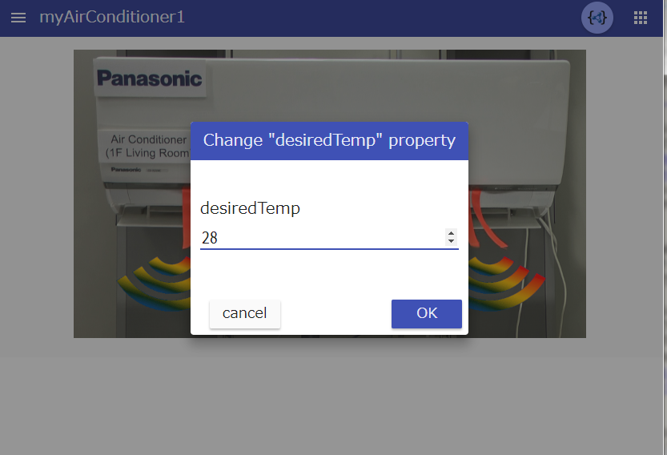
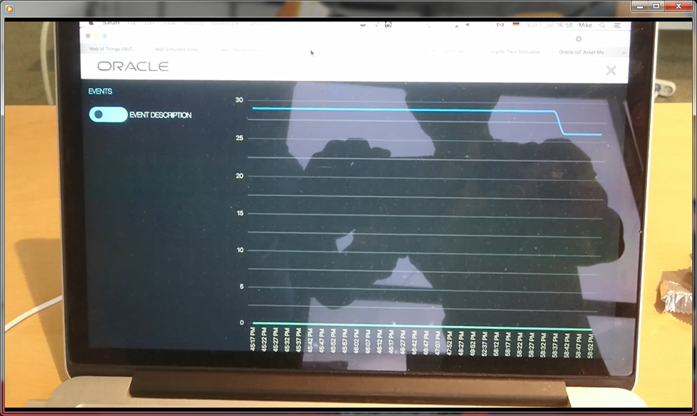

# PlugFest Preparation for Bundang 2018

This document describes the Bundang PlugFest held on June 30 and July 1.

A summary of the previous Prague PlugFest can be found [here](https://github.com/w3c/wot/blob/master/plugfest/2018-prague/result.md).

Features marked with <i>italics</i> are work-in-progress.

The result of individual item is marked with [RESULT].

## 1 PlugFest Infrastructure
This section lists the infrastructure available for the PlugFest, which can be used for individual testing (see [Section 3.1](#31-testing-individually))

### 1.1 Public Thing Directories

* N/A

### 1.2 Public Proxies

* N/A

### 1.3 Public Tools

#### Oracle IoT Cloud Service
Oracle provides a share instance of the IoT Cloud Service for W3C WoT members.
It allows testing integration and interpoerability scenarios with a real world IoT Cloud Server.

Oracle IoT Cloud Service - Management console at https://129.150.193.97/ui

#### Oracle Digital Twin Simulator
Oracle provides a Digital Twin Simulator for W3C WoT members, which is part of the Oracle IoT Cloud Service product.
This is a flexible simulation environment, which hosts multiple instances of various devices and a
simulation engine that allows the functional definition of a simulated device from a Web user interface.
It allows to build new device simulations with very small effort.

Oracle IoT Digital Twin Simulator - Simulator console at https://129.150.193.97/ui

Login credentials are available for all plug fest participants from Michael.Lagally@oracle.com.

## 1.2 Participants and Servients

<table>
  <tr>
    <th>Participants</th>
    <th>Appliation</th>
    <th>=protocol=</th>
    <th>Remote proxy</th>
    <th>=protocol=</th>
    <th>Local proxy</th>
    <th>=protocol=</th>
    <th>Device</th>
  </tr>
  <tr>
    <td>Oracle</td>
    <td>IOT Cloud Service</td>
    <td>REST/HTTP(s)</td>
    <td>N/A</td>
    <td>REST/HTTP(s)</td>
    <td>Accessible via node-WoT + Oracle binding</td>
    <td>REST/HTTP(s)</td>
    <td>Cloud Service Management Console</td>
  </tr>
  <tr>
    <td>Oracle</td>
    <td>Digital Twin Simulator</td>
    <td>REST/HTTP(s)</td>
    <td>N/A</td>
    <td>REST/HTTP(s)</td>
    <td>Accessible via node-WoT + Oracle binding</td>
    <td>REST/HTTP(s)</td>
    <td>on-demand simulations for Plugfest participants' devices based on TDs</td>
  </tr>
  <tr>
    <td>Oracle</td>
    <td>Festo-Simulator5</td>
    <td>REST/HTTP(s)</td>
    <td>N/A</td>
    <td>REST/HTTP(s)</td>
    <td>Accessible via node-WoT + Oracle binding</td>
    <td>REST/HTTP(s)</td>
    <td>Festo Simulator</td>
  </tr>
  <tr>
    <td>Oracle</td>
    <td>Audi-A8-4</td>
    <td>REST/HTTP(s)</td>
    <td>N/A</td>
    <td>REST/HTTP(s)</td>
    <td>Accessible via node-WoT + Oracle binding</td>
    <td>REST/HTTP(s)</td>
    <td>Connected Car</td>
  </tr>
  <tr>
    <td>Oracle</td>
    <td>HVAC2</td>
    <td>REST/HTTP(s)</td>
    <td>N/A</td>
    <td>REST/HTTP(s)</td>
    <td>Accessible via node-WoT + Oracle binding</td>
    <td>REST/HTTP(s)</td>
    <td>HVAC</td>
  </tr>
  <tr>
    <td>Oracle</td>
    <td>BMW_X5-3</td>
    <td>REST/HTTP(s)</td>
    <td>N/A</td>
    <td>REST/HTTP(s)</td>
    <td>Accessible via node-WoT + Oracle binding</td>
    <td>REST/HTTP(s)</td>
    <td>BMW_X5</td>
  </tr>
</table>

## 3 Checking points for the next plugfest

### 3.1 Testing Individually
The following checking points can be completed by the participant alone by using the PlugFest infrastructure (TD Playground, Thing Directory, Proxies).

#### 3.1.1 Validate Simplified TDs

Oracle provides a Digital Twin Simulator for W3C WoT members, which is part of the Oracle IoT Cloud Service product.
This is a flexible simulation environment, which hosts multiple instances of various devices and a
simulation engine that allows the functional definition of a simulated device from a Web user interface.
It allows to build new device simulations with very small effort.

[RESULT]
- Multiple TDs from all participants in [repository](https://github.com/w3c/wot/tree/master/plugfest/2018-bundang/TDs) 
  have been validated by the td2dm converter.
- Several issues were found and reported to individual companies. 
  Some TDs, which contain sub-properties caused issues, which could be resolved by name-mangling.
- New device simulators were created for the KETI and Eurecom devices based on their TDs.

#### 3.1.2 Register with Thing Directory

N/A

#### 3.1.3 Connect with Remote/Local Proxy

[RESULT] The Oracle IoT Cloud Service are accessible via the Fujitsu proxy via the Oracle binding which was implemented by Fujitsu.

#### 3.1.4 Connect with node-wot

[RESULT] The Oracle IoT Cloud Service and the devices in the Digital Twin Simulator are accessible via a node-WoT 
instance which includes an Oracle binding implemented by Siemens. This binding provides the integration between the IoT Cloud Service Product 
and the node-WoT reference implementation.

#### 3.1.5 Scripting API
N/A

### 3.2 Testing in Client Role
The following checking points must be completed together with a partner in server role.

#### 3.2.1 Metadata Handling

N/A

#### 3.2.2 Property Handling

N/A

#### 3.2.3 Action Handling

N/A

#### 3.2.4 Event Handling

N/A

#### 3.2.5 Security

N/A

#### 3.2.6 Semantic integration

N/A

#### 3.2.7 Accessibility

N/A

### 3.3 Testing in Server Role
The following checking points must be completed together with a partner in client role.

#### 3.3.1 Metadata

The Oracle IoT Cloud Service and the devices in the Digital Twin Simulator are accessible via a node-WoT instance
which includes an Oracle binding. 
This binding provides the integration between the IoT Cloud Service Product and the node-WoT reference implementation.

[RESULT]
Oracle exposed various simulated devices via TDs in [repository](https://github.com/w3c/wot/tree/master/plugfest/2018-bundang/TDs/Oracle).
Metadata fields between the Oracle Device Model and the Thing Descriptionds were mapped.

#### 3.3.2 Properties

Oracle provdes set and get bindings for device properties via HTTP(S)

[RESULT]
Oracle's Node-WoT based client polled Panasonic's [Simulator Air Conditioner](https://github.com/w3c/wot/blob/master/plugfest/2018-bundang/TDs/Panasonic/simulator/PanasonicSimulatedAirConditioner1.jsonld) 
 and updated the temperature property periodically.

#### 3.3.3 Actions

* Oracle provides a HTTP(s) binding to invoke actions via HTTP(S). 

[RESULT] The binding was used by Fujitsu and Siemens to execute actions on devices.

#### 3.3.4 Events

N/A

#### 3.3.5 Security

* Oracle provides the following Security Schemes:
   * basic
   * oauth

[RESULT]
* Oracle's
[Festo Simulator](https://github.com/w3c/wot/blob/master/plugfest/2018-bundang/TDs/Oracle/Festo-Simulator5.jsonld)
was successfully accessed by Panasonic's Generic WoT client using basic auth.
* Fujitsu's Local Proxy used basic auth to successfully access the Oracle IoT Cloud Service.

#### 3.3.6 Semantic Integration

N/A

### 3.4 Other issues

#### 3.4.1 Running Actions and Event Instances 

* N/A 

#### 3.4.2 Discovery using Feature of Interest

* N/A

#### 3.4.3 New Security Patterns

* N/A

#### 3.4.4 Miscellaneous

* N/A

## 4 Use cases

Multiple integration scenarios with other WoT devices and servients.
Integration and exposure of simulated devices.

## 5 Requirements for PlugFest Environment

| Participant | Number of Participants | Number of Power outlets | Network | Remarks |
|-------------|------------------------|-------------------------|---------|---------|
| Oracle | 1                      | 1                       | Wi-Fi |  |

## 6 Implementation Guidelines

N/A
