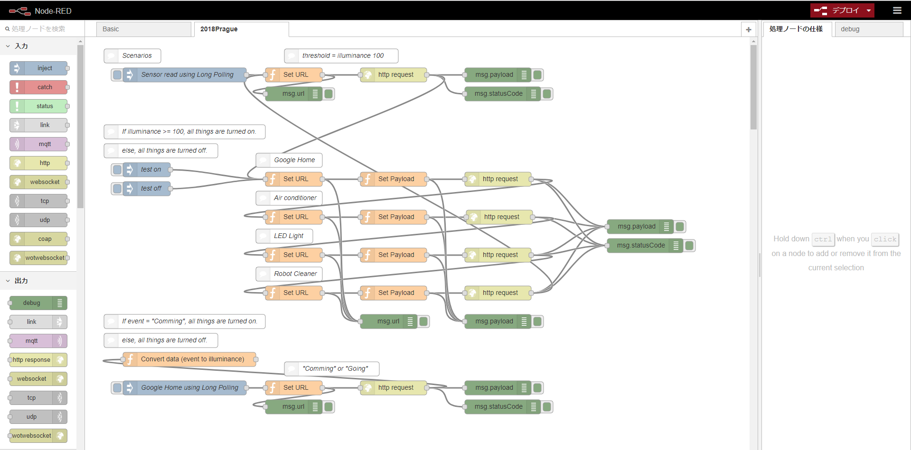
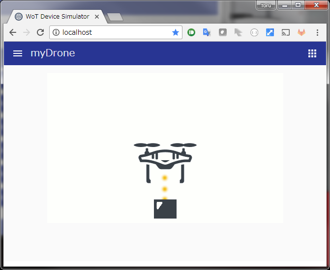
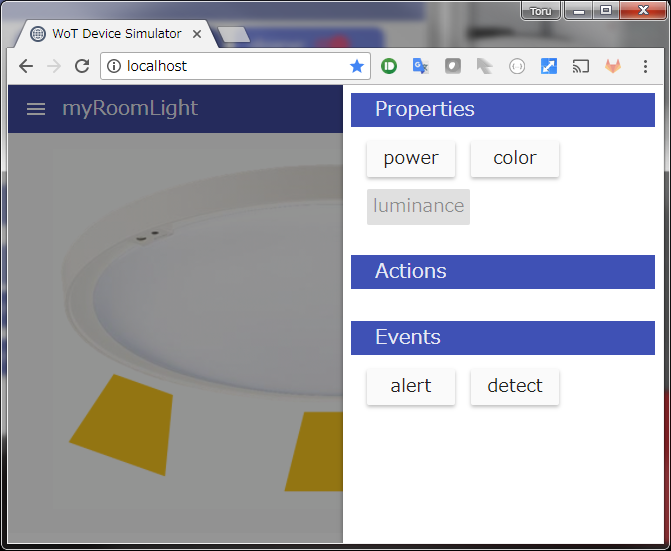

### 2.4.1 Application Servients
- Scripting App

    

    - Composition
        - Client Scripting API Javascript Library
          - Only supports consumed thing (no exposed thing support)
          - Only supoprts HTTP/HTTPS (no COAP/MQTT support)
          - Supports notification through HTTP Long Polling and Panasonic WebSocket method.
        - HTML+JavaScripting client
          - Generic WoT Client which reads Thing Description from the URL written in input field, then shows Properties/Actions/Events on its UI.
          - Supports read/write/observe(subscribe) of Properties.
          - Supports invoking Action.
          - Supports subscribing Event.
          - Observed Property change and firing Event are shown as desktop notification.
    - Plugfest result
        - Connected with following Panasonic Device Servients locally and through Fujitsu proxy
          - Actions of Drone on Panasonic Simulator
          - Property Observe and Events of Room Light on Panasonic Simulator

- Node RED

      

    

    - Plugfest result
        - Orchestrated Observe Property of Fujitsu Brightness Sensor to Write Property of Panasonic LED light, Air conditioner, Robot Cleaner and to invoke Action of Google Home speaking
        - Orchestrated Observe Property of Fujitsu Brightness Sensor to Write Property of Panasonic Room Light on Simulator
        - Connected with following Device Servients locally
          - Siemens: FestoLive, EventSource
          - Intel: OCF Smart Home RGB LED, Web Camera
          - SmartThings: Light, Motion Sensor
          - EUROCOM: BMW X5, BMW S7

### 2.4.4 Device Servients
- Remote Device Servients  
    - Composition
        
    - Plugfest result
        - Registered to Fujitsu proxy.
        - Connected with Panasonic Scripting App locally
        - Connected with Panasonic Node RED, orchestrated with Fujitsu Brightness Sensor.
        - Connected with Fujitsu Node RED through Fujitsu proxy
- Simulator

    

    

    - Composition
        - Simulator which provides HTTP WoT interface as well as HTML UI.
          - Supports local control of changing Properties and firing Events.
          - Supports remote control of read/write/observe(subscribe) of Properties, invoking Action and subscribing Event through WoT interface.
          - Supports showing GIF image including GIF animation, switched according to local and remote control.
          - Materials prepared at plugfest: Drone and Room Light
        - Event server which handles client connection for notifications (both Property Observer and Event; both HTTP Long Polling and Panasonic WebSocket method).
    - Plugfest result
        - Registered to Fujitsu proxy.
        - Connected with Panasonic Scripting App locally and through proxy.
        - Connected with Panasonic Node RED, orchestrated with Fujitsu Brightness Sensor.

# 3. Considerations
## 3.1 Evaluation against "Checking point for the plugfest" from [PlugfestSummary180418.pdf](https://github.com/w3c/wot/blob/master/plugfest/2018-prague/docs/PlugfestSummary180418.pdf) by Matsukura-san

1. Connect with remote/local proxy (narrow waist model)
    - Both Application Servients and Device Servients are successfully connected to Fujitsu remote/local proxy.

2. Application servient
    - Supported both Scripting App and NodeRED
    - Future work: cross domain scenario (home, mobility, social infrastructure, etc) with meaningful scenario.

3. Connect with node-wot
    - (Not connected)

4. Scripting API
    - Support Consumed Thing in JavaScript scripting API.
    - (Exposed Thing not supported)

5. Thing Directory
    - Did not provide directory by ourselves.
    - Registered and retrieved TDs to/from Fujitsu's directory through a tool (Advanced REST Client and POSTMAN).
    - Future work: Automatic registration when starting WoT Server; Integrated retrieval from WoT Client.

6. Many kinds of device servients
    - Several Local and Remote Device Servients are provided (See [2.4.4](result-panasonic.md#244-device-servients))

7. Semantic discovery
    - Some TDs support semantic annotation.
    - Future work: Application using semantic discovery with meaningful scenario.

8. Security, Accessibility
    - HTTPS and bearer token are supported
    - Future work: Authentication

9. Event handling with long polling
    - Supported by some Device Servients (Air-conditioner and Lighting on Simulator)

10. Device simulators
    - Device Simulator works on Raspberry-Pi, PC and cloud.

## 3.2 Issues faced at site
1. CORS issue when using Scripting app on browser.
    - To be accessed by browser through XMLHTTPRequest, WoT Servients need to add "Access-Control-Allow-Origin: * " header in it's response to the requests including OPTIONS method.
2. Multiple "form" issue when using Fujitsu proxy
    - Fujitsu proxy currently does not support multiple "form" for one property.
    - In Panasonic TD, "read/write" and "observe" to a same property is expressed as two different HTTP endpoints  
      ->changes to two different property were necessary.
